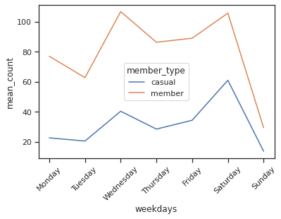
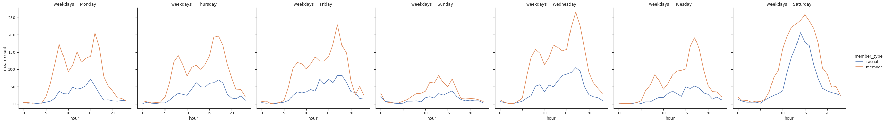

Dear Richard,

Thank you for your email.
I have summarized three points below based on your inquiry and suggested solutions for each point. 

- Situation1: Last week, the demand of registered bike riders, who were mostly working profiessional, was higher than the usual usage. 
  >- Task: Find out how to reduce the complaints - to keep the availiability of rental bikes high enough.
  >- Action: 
  >We analyzed the demand of registered bike users and specifically the status of bike usages related to commute hours (e.g., 7-9 am and 17-19pm) given that 80% of those registered users are working professionals. 
  >- Results: 
  >We found out that the demand of registered users is most high on wednesday and saturday, specifically during commute hours (e.g., between 6-9 AM and 16-19pm). 
  >So, we suggest you to prepare more bikes during commute hours on weekdays, and during datytime (e.g., 8am to 20pm) on saturday.
  
  

- Situation2: You also want to avoid the complaints from Casual users. 
  >- Task: Find out when is the highest demand of casual users. 
  >- Action: We analyzed the average demand of registered bike users (with its range, std) 
  >- Results: We found out that the pattern of casual users usage is similar to registered users, except that there is no peak of demand during commute hours. So we suggest you to prepare more bikes during weekdays and during datytime (e.g., 8am to 20pm) on saturday.

- Situations3: There are a few important factors influencing the actual usage of users, such as "weathers (rainy days)" and "pollution", and "traffic" situations. 
  >- Task: Analyze how weather and pollusion, trafic affects the demand of bike rental users. 
  >- Action: Analyze how each factor is correlated with the demand of registerd and casual users, and provide a explanation for each user type.
  >- Results: We have found that the weather affects, but we need more time to provide more reliable suggestions. Currently we are training the model to predict the relationship between the (expected) weather during upcoming days and the demand based on previous usage history. 

Thank you for taking time to check these details. 

Please feel free to contact me if any information is missing/unclear and/or you have any question. 

Hope you have a good start of this week !

Best,

Jay